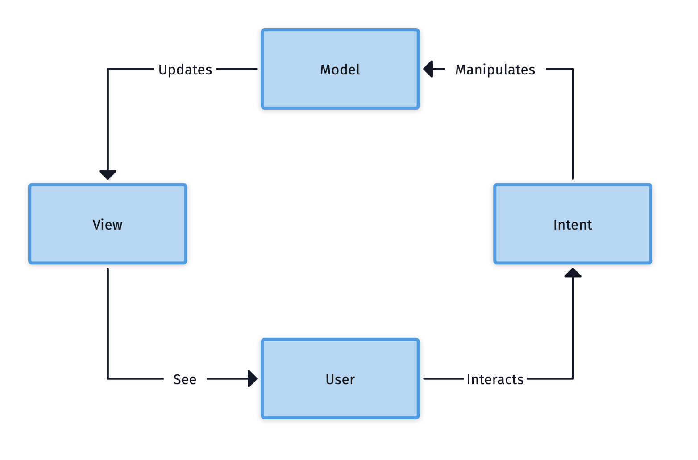

# PKDex-iOS

Proof concept of modularized app with SwiftPackages built over MVI + Combine + SwiftUI in a single repo

## Introduction

This project is a proof of concept to test and practice mainly the architecture and new trends in iOS development. Therefore, it will be a project in constant evolution and that can serve as a guide or model for other types of applications ready to be in production (Production Ready) for me, in which, having the architectural base already made, the speed of development should be much more quick for future features.

The main motivation to start this is precisely the paradigm shift that iOS and Android are taking on how to design an App, since they began to take a much more natural path towards a paradigm focused on "Unidirectional data flow" with the availability of Combine API on iOS and Flow on Android, in addition to a new way of designing the UI in a more declarative way with framework SwiftUI on iOS and Compose on Android, promoting the unification of a single Desing System definition for Apps.

Another main motivation is to find a balance in a modular app without having to deal with multiple repositories as much as possible, which in the case of small teams can be more of a brake on development speed than a real help, so the idea is build this app using Swift Packages (located in this same repository, but eventually if required, it is easy to move it to an independent repository).

## Goals

- Make an app with Clean Architecture and SOLID principles.
- Use an architecture with unidirectional data flow, for this occasion I decided to do it in MVI using Combine and SwiftUI.
- Create an MDK (Mobile Development Kit) with all the components and reusable code that can be used in this project and in other future projects.
- Modular by features.

## Architecture

The modules that will be built consist of the Base App module, which only acts as a container and which will be in charge of registering all the components for the injection of dependencies, the Main Scene of the app will mount the modules and will have a Router for the navigation of the app.

- **App**: Main container of the App, contains the Navigation Router and the main Scene
- **Core**: Contains contracts and common components of the App (states of the scenes, it could also contain all the logic of notifications, deeplinks, etc).
- **Listing**: Module for the pokemon listing
- **Detail**: Module to show the detail of a pokemon
- **Favorites**: Module with the status of favorite pokemon.
- **Design**: Module with the design contracts to set up a Design System that can be consumed by the Feature modules (icons, reusable views, color palette, etc.)
- **APIs**: Module with the detail of third-party APIs that can be directly used by the different Feature modules.

The modules will be built with Clean Architecture, this means that the domain layer must contain its own domain entities and their use cases, and must not depend on or know details of the data or presentation layer. In these last layers to avoid the coupling of libraries we are going to use interfaces that encapsulate all the behavior of the functionalities, which will allow us using a strategy pattern (aka [Providers](https://github.com/mzapatae/AltairMDK-iOS/tree/main/Sources/Providers) in the MDK) to be able to change the implementations of the libraries easily (we could easily change to run network calls with NSUrlSession to Alamofire easily).

In practice, this project shows a structure like the following

## MVI: Model - View - Intent

MVI is a unidirectional data flow architecture that was designed to be used in reactive programming, where the model represents the source of truth for the application, the intent is an interaction that the user (or the system itself) can trigger and causes the state of the system mute to a new state, which will be rendered in the view. This allows us to make the code more readable and more scalable by adding new states or actions, making it easier to debug it knowing what is the state of the app in any time.

Each module in its presentation layer will be built under an MVI architecture, which will allow us to have a source of truth only in the scope of its domain, which could eventually be imported and read by other modules that need to know the status of that domain. . In addition, each module defines its actions, a reducer that contains the rules to mutate the current state to a new state in response to an action and the module's side effects (which will execute network tasks, database or collateral effects).

All this behavior will be encapsulated in a Store with which a viewmodel can be imported to connect it to a view

This allows the stores can be imported by other ViewModels that need to know about states or trigger specific actions handled by that Store. For example, the ViewModel of the Listing module imports the Store of its own module in addition to importing the Store of the Favorites module to be able to render a list of favorite pokemon, as well as the listing can trigger actions of favorites to store or delete favorites.

## Roadmap

[*] Implement App Base
[*] Implement Listing
[*] Implement Favorites
[] Implement the Detail module
[] Make complete battery of unit tests
[] Improve UI and make them more attractive, in addition to dark mode
[] Implement CI
[] Improve implementations with Futures / Promises or Async / Await

## MDK: Mobile Development Kit

The project is being used with an MDK that you can find [here](https://github.com/mzapatae/AltairMDK-iOS) that contains extensions and utilities in addition to providers for network and storage (more providers will come in the future and a more detailed documentation).

## How to use

- Just open the workspace `PKDex.xcworkspace` using and compile/run the project using the scheme `PKDex (iOS)`.
